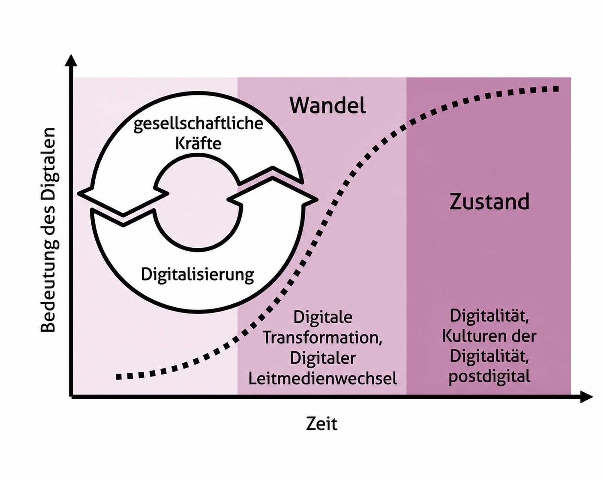

## 

{#fig-digitalisierung-digitalitaet width=100% fig-alt="Diagramm: Die Bedeutung des Digitalen nimmt über die Zeit zu. Digitalisierung ist ein wiederkehrender Prozess gesellschaftlicher Kräfte; Digitalität bezeichnet den entstehenden Zustand."}

##

](resources_free/abbildung-2-1-reaktionen-der-schule-auf-den-leitmedienwechsel-violett.png){#fig-reaktionen-schule-leitmedienwechsel width=100% fig-alt="Mögliche Reaktionen der Schule auf den digitalen Leitmedienwechsel: von Ignorieren über Integration in alle Fächer bis zur Revolutionierung."}

::: {.notes}
@edk2024

:::

## Mit Daten und Informationen umgehen

{width=42% fig-alt="Stilisierte Darstellung eines Börsencharts mit ansteigenden und fallenden Kurslinien."}

::: {.fragment .center-quote data-fragment-index="1"}
Filtern · Verarbeiten · Auswerten
:::

::: {.notes}
Daten und Informationen haben in einer Kultur der Digitalität eine zentrale Bedeutung. Während in einer Buchdruckgesellschaft der Zugang zu Informationen das entscheidende Problem darstellte, steht in einer Informationsgesellschaft das Filtern, Verarbeiten, Auswerten und zielgruppengerechte Darstellen von oft sehr grossen Datenmengen im Vordergrund.

Entscheidend ist zudem die Fähigkeit, sich kritisch mit Daten, Informationen und Medieninhalten auseinanderzusetzen. Das betrifft insbesondere ethische Aspekte der Datenerfassung und Datenbearbeitung sowie ein Bewusstsein für die Herkunft und faktische Korrektheit von Informationen.

**Konkrete Beispiele aus einzelnen Fächern:**

- **Mathematik:** Die Klasse erhebt Daten zum Schulweg, erstellt verschiedene Diagrammtypen und begründet, welches Diagramm die Fragestellung am ehrlichsten beantwortet.
- **Geografie:** Lernende vergleichen zwei Karten zur weltweiten Migration und prüfen, welche Daten fehlen, wie die Legende wirkt und wer die Karten herausgegeben hat.
- **Biologie:** Nach einem Versuch zur Pulsfrequenz dokumentieren die Lernenden Messwerte, bestimmen Ausreisser und beurteilen, welche Aussage die kleine Stichprobe zulässt.
:::

## Verfahren der Automatisierung verstehen und anwenden

{width=42% fig-alt="Stilisierte Darstellung eines Roboters, der einen Stempelvorgang ausführt."}

::: {.fragment .center-quote data-fragment-index="1"}
Strukturieren · Lösen · Reflektieren
:::

::: {.notes}
Die Verfügbarkeit von Informationen in digitaler Form begünstigt die Automatisierung von Prozessen, sei es durch den Einsatz herkömmlicher Programme oder durch Verfahren der Künstlichen Intelligenz.

Damit sind drei Arbeitsbereiche verbunden:

1. Passende Werkzeuge in praktischen Kontexten kompetent einschätzen und einsetzen.
2. Auswirkungen erkennen, kritisch prüfen und in einem ethischen Kontext reflektieren.
3. Aufgaben und Herausforderungen mithilfe algorithmischer Verfahren strukturieren, bearbeiten und lösen.

Automatisierung und Künstliche Intelligenz eröffnen neue Möglichkeiten und Handlungsfelder. Das betrifft auch die kreative Gestaltung von Lernprodukten.

**Konkrete Beispiele aus einzelnen Fächern:**

- **Informatik:** Lernende programmieren einen Entscheidungsbaum für die Ausleihe von Sportmaterial und testen, ob Sonderfälle korrekt behandelt werden.
- **Mathematik:** Bei einer Tabellenkalkulation zu Zinseszins identifizieren die Lernenden, welche Rechenschritte automatisiert sind, und überprüfen ein Ergebnis mit einer Gegenrechnung.
- **Französisch:** Eine KI erstellt einen ersten Dialogentwurf; die Lernenden markieren falsche oder unpassende Formulierungen und verbessern den Text anhand der gelernten Sprachmittel.
:::

## Mit Modellen komplexe Sachverhalte analysieren

{width=42% fig-alt="Stilisierte Darstellung eines Vererbungsdiagramms mit verbundenen Merkmalen."}

::: {.fragment .center-quote data-fragment-index="1"}
Simulationen · Interaktiv
:::

::: {.notes}
Die automatisierte Datenverarbeitung ermöglicht es, auch komplexe Modelle der Realität zu erstellen, interaktiv zu erforschen und dadurch ein vertieftes Verständnis von funktionalen Zusammenhängen zu entwickeln.

Damit gewinnt die Arbeit mit Modellen und Formen der Vereinfachung an Bedeutung. Zudem erlauben Simulationen und spielerische Umgebungen neue Formen von Erfahrung, Lernen und Interaktion, die dabei helfen können, die mit komplexen Systemen verbundenen Herausforderungen zu bewältigen.

**Konkrete Beispiele aus einzelnen Fächern:**

- **Physik:** Mit einer Simulation zu Stromkreisen verändern die Lernenden Spannung und Widerstand, bevor sie begründen, weshalb das digitale Modell reale Messungen nicht vollständig ersetzt.
- **Geografie:** An einer Klimasimulation vergleichen die Lernenden zwei Emissionsszenarien und halten fest, welche Annahmen hinter den Ergebnissen stehen.
- **Mathematik:** Die Lernenden modellieren den Füllstand eines Wassertanks mit einer Funktion und prüfen, an welcher Stelle die Vereinfachung nicht mehr zur realen Situation passt.
:::

## Digitale Identität reflektieren

{width=42% fig-alt="Stilisierte Darstellung eines Virtual YouTubers mit Katzenohren."}

::: {.fragment .center-quote data-fragment-index="1"}
Identitätsbildung · Privatsphäre
:::

::: {.notes}
Die persönliche Entwicklung und Teilhabe an der Gesellschaft sind auch mit der Gestaltung und Pflege medialer Repräsentationen der eigenen Identität verknüpft. Diese ist die Grundlage der Gestaltung von sozialen Beziehungen im digitalen Raum.

Solche Prozesse zu verstehen und Einfluss darauf nehmen zu können ist wichtig, auch weil Datenspuren in digitale Formen der Identitätsbildung einfliessen und Auswirkungen haben in Bezug auf Privatsphäre und das Grundrecht auf informationelle Selbstbestimmung.

**Konkrete Beispiele aus einzelnen Fächern:**

- **Deutsch:** Die Klasse analysiert zwei öffentliche Profiltexte: Welche Wirkung entsteht sprachlich und welche Informationen über die Person werden preisgegeben?
- **Bildnerisches Gestalten:** Lernende erstellen ein Selbstporträt für eine fiktive Ausstellung und entscheiden begründet, welche Bildinformationen sie veröffentlichen würden.
- **ERG:** An einem Fall zu einer Standortfreigabe diskutieren die Lernenden, wer Zugriff auf welche Daten haben sollte und wie eine informierte Einwilligung aussieht.
:::

## Kommunikation und Kollaboration gestalten

{width=42% fig-alt="Stilisierte Darstellung mehrerer Personen, die digital zusammenarbeiten."}

::: {.fragment .center-quote data-fragment-index="1"}
Wissenserwerb · Partizipation
:::

::: {.notes}
Der einfache Zugang zu vernetzten Plattformen erlaubt es, Interaktion mit anderen Menschen von zeitlichen und räumlichen Beschränkungen zu lösen. Vermittlungsinstanzen verlieren an Bedeutung: Wer Wissen hat, kann es direkt weitergeben.

Das ist mit neuen Aufgaben verbunden, die kommunikativ bewältigt werden müssen. Gleichzeitig ergeben sich aber auch zusätzliche Möglichkeiten für Wissenserwerb, Zusammenarbeit und Partizipation, die produktiv zu nutzen sind.

**Konkrete Beispiele aus einzelnen Fächern:**

- **Deutsch:** In einem gemeinsamen Dokument verfassen Lernende einen Kommentar; sie weisen Änderungen einer Person zu und geben Feedback nach vorher vereinbarten Regeln.
- **Musik:** Eine Gruppe produziert einen Podcast zu einem Werk, organisiert Dateien in einer gemeinsamen Ablage und hält Quellen sowie Nutzungsrechte für Tonmaterial fest.
- **Geschichte:** Teams erstellen eine digitale Zeitleiste; sie teilen Rechercheaufträge auf, diskutieren widersprüchliche Quellen im Kommentarbereich und dokumentieren ihre Entscheidungen.
:::

## Informationsgesellschaft verstehen

{width=42% fig-alt="Stilisierte Darstellung mehrerer Personen, die digital zusammenarbeiten."}

::: {.fragment .center-quote data-fragment-index="1"}
Nachhaltige Entwicklung · Datensicherheit
:::

::: {.notes}
Digitalität beeinflusst ökonomische, soziale und politische Zusammenhänge und wird umgekehrt von diesen geprägt. Damit verbundene Entwicklungen erfolgen in kurzer Zeit und schaffen neue Voraussetzungen für menschliches Handeln.

Deshalb ist es bedeutsam, entsprechende Dynamiken zu reflektieren, Risiken zu erkennen und sich verantwortungsbewusst zu ihnen zu verhalten. Rahmenbedingungen nachhaltiger Entwicklung sowie Aspekte der Datensicherheit verdienen dabei besondere Beachtung.

**Konkrete Beispiele aus einzelnen Fächern:**

- **Geografie:** Lernende untersuchen die Arbeit einer Lieferplattform in einer Stadt und ordnen Folgen für Arbeitsbedingungen, Verkehr und lokale Geschäfte ein.
- **Geschichte:** Die Klasse vergleicht die Einführung des Buchdrucks mit sozialen Netzwerken und diskutiert, welche Akteure damals und heute Öffentlichkeit prägen.
- **WAH:** Lernende recherchieren den Ressourcenverbrauch von Streaming und entwickeln Kriterien für eine nachhaltigere Mediennutzung im Alltag.
:::
